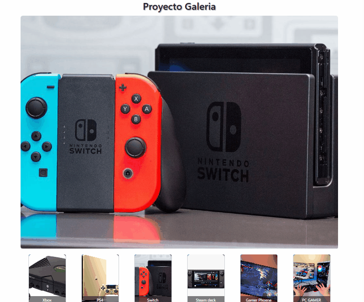

# Práctica de react-router-dom SPA (Single-Page Application)

Este proyecto es una práctica de SPA con react-router-dom, en una aplicación frontend con React + Vite.

## Instalación

Para ejecutar este proyecto en tu máquina local, sigue estos pasos:

1. Clona este repositorio en tu máquina local (Crea un Fork si lo vas a editar):

    ```bash
    git clone https://github.com/CristiansArevalom/boot2_react_gallery.git
    ```

2. Navega al directorio del proyecto:

    ```bash
    cd boot2_react_gallery
    ```

3. Instala las dependencias del proyecto utilizando npm:

    ```bash
    npm install
    ```

## Ejecución del Proyecto

1. Inicia el servidor de desarrollo:

    ```bash
    npm run dev
    ```

2. Abre tu navegador y ve a:

    ```
    http://localhost:5173  (revisa el número de tu puerto en la consola donde iniciaste el servidor de desarrollo)
    ```

> [!NOTE]
> Asegúrate de tener Node.js y npm instalados en tu máquina antes de iniciar el proyecto.

## Scripts Disponibles

- `npm run dev`: Inicia el servidor de desarrollo.
- `npm run build`: Compila la aplicación para producción.
- `npm run preview`: Previsualiza la aplicación compilada.

> [!TIP]
> Utiliza `npm run build` antes de desplegar la aplicación en un entorno de producción para optimizar el rendimiento.

## Funcionamiento del Proyecto

La galería muestra las imágenes en la parte superior, cuando se hace clic sobre alguna de las miniaturas de abajo. A continuación, se muestra una captura de pantalla del funcionamiento del proyecto:


---

## Contribuciones

> [!TIP]
> ¡Si te gustó este proyecto, puedes dejarme una estrella en el repositorio! 🌟

> [!NOTE]
> Por favor, sigue las guías de contribución y buenas prácticas antes de enviar un Pull Request.

